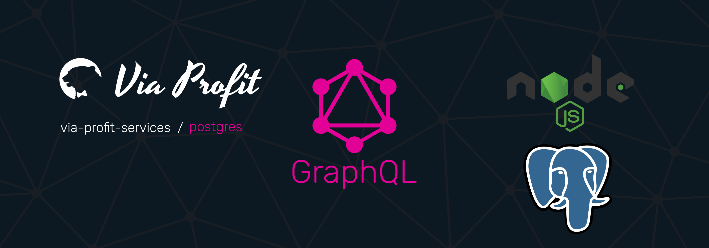

# Via Profit services / Knex Postgres

> Via Profit services / **Postgres** - node-postgres provider.

This module is a provider that extends the GraphQL [Сontext](https://github.com/via-profit-services/core/blob/master/README.md#context) by adding `postgres` instance with an already initialized connection to your postgreSQL database.

## Documentation [here](https://node.e1g.ru/docs/postgres)

## License
The  [MIT](./LICENSE) License.